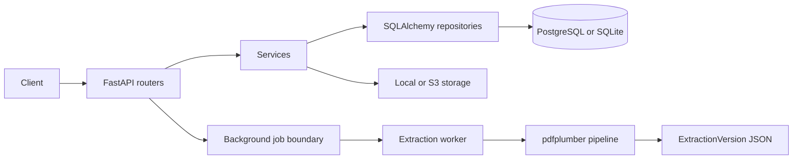

# FilingLens

FilingLens turns complex SERFF insurance filings into review-ready structured data. It combines deterministic PDF extraction, SERFF-aware classification, source evidence, extraction confidence, and Review Radar flags in a focused compliance workspace.

## Product workflow

```text
Login -> Upload filing -> Async extraction -> Filing Snapshot
	-> Review Workspace -> Evidence -> Review Radar -> Export
```

The primary output is structured data, not plain PDF text. Every extracted section retains its source page and available bounding box so reviewers can trace results back to the filing.

## Architecture



The backend uses routers -> services -> repositories. The frontend uses Axios, TanStack Query, Zustand, React Hook Form, Zod, and reusable shadcn-style primitives. Upload validates the PDF, stores it under a generated UUID key, persists a queued document, and schedules extraction outside the request. The worker writes `uploaded`, `queued`, `processing`, `completed`, or `failed` state and progress fields.

## Repository layout

```text
backend/
	app/
		api/              FastAPI routes and dependency wiring
		core/             settings, JWT security, logging, request middleware
		db/               async engine, models, repositories, Redis client
		extraction/       parsers, detectors, classifiers, confidence, Review Radar
		models/           User, Document, ExtractionVersion, AuditEvent
		schemas/          Pydantic request and response contracts
		services/         authentication, documents, extraction, review, exports, audit
		storage/          local filesystem and optional S3-compatible adapters
		workers/          queue boundary and extraction worker
	alembic/            migration environment and revisions
frontend/
	src/api/             Axios client and typed endpoint modules
	src/components/ui/   reusable shadcn-style primitives
	src/stores/           Zustand auth and workspace state
	src/types/            backend-aligned TypeScript types
	src/App.tsx           routes, dashboard, upload, filing workspace
tests/                  backend and extraction tests
```

## Import and library responsibilities

### Backend imports

- `fastapi`: HTTP routes, dependency injection, multipart uploads, lifecycle hooks, and HTTP errors. Routes coordinate requests; services own workflows.
- `sqlalchemy.ext.asyncio`: async engine and sessions for non-blocking database access. Repositories contain reusable queries.
- `sqlalchemy.orm`: typed ORM mapping through `Mapped` and `mapped_column`.
- `alembic`: versioned database migrations, kept separate from application startup.
- `pydantic` and `pydantic-settings`: request validation and environment configuration.
- `bcrypt`: password hashing and verification. Plain passwords are never stored or logged.
- `PyJWT`: HS256 access and refresh token signing and verification.
- `pdfplumber`: PDF page text, words, font attributes, coordinates, and tables. The pipeline preserves evidence instead of flattening the filing.
- `structlog` and Python `logging`: JSON production logs or readable local logs, Uvicorn integration, request IDs, and secret redaction.
- `redis.asyncio`: Redis connection and production queue integration point.
- `boto3`: optional S3-compatible storage adapter, loaded only when S3 storage is selected.

### Extraction data flow

1. `parsers/pdf_parser.py` calls `pdfplumber` and emits pages containing text, words, dimensions, and tables.
2. `parsers/page_parser.py` reconstructs visual lines from word coordinates.
3. `detectors/heading_detector.py` combines font size, boldness, position, numbering, length, SERFF vocabulary, and context into weighted confidence.
4. `detectors/serff_detector.py` maps SERFF terminology to section types without assuming a fixed filing template.
5. `detectors/section_detector.py` builds page-ranged sections with source evidence.
6. `detectors/metadata_detector.py` extracts available key/value fields and source pages.
7. `parsers/table_parser.py` preserves columns, rows, pages, bounding boxes, and confidence.
8. Attachment and correspondence modules classify domain records and retain source pages.
9. `confidence/confidence_engine.py` assigns high, medium, or low extraction confidence. It is not legal certainty.
10. `review/review_radar.py` creates deterministic extraction-review flags for uncertainty, missing sections, duplicates, unmatched responses, and inconsistent metadata.
11. `pipeline.py` assembles the structured JSON consumed by the API, exports, and frontend workspace.

### Frontend imports and data flow

- `axios` is configured once in `frontend/src/api/client.ts` for base URL, bearer tokens, refresh retry, and timeout.
- `@tanstack/react-query` owns server state, caching, polling, document lists, extraction versions, and review flags.
- `zustand` owns client-only auth and workspace state such as selected section, page, search, and mobile pane.
- `react-hook-form` and `zod` manage login/register form state and client validation while the backend remains authoritative.
- `react-router-dom` provides public, protected, dashboard, upload, and filing workspace routes.
- `sonner` reports meaningful upload, extraction, export, copy, login, and logout events without exposing secrets.
- `lucide-react` provides consistent action icons.
- Tailwind CSS v4 and local shadcn-style primitives provide design tokens and accessible UI building blocks.
- The source pane displays real extracted page text and returned coordinates; it does not fabricate PDF pages when no source-file endpoint exists.

## Stack

- Backend: Python 3.12, FastAPI, SQLAlchemy 2 async, Alembic, Pydantic v2, pdfplumber
- Data and jobs: PostgreSQL or SQLite, Redis-compatible queue boundary, local or S3-compatible storage
- Frontend: React, TypeScript, Vite, Tailwind CSS v4, Axios, TanStack Query, Zustand, Zod
- Security: bcrypt passwords, HS256 JWT access/refresh tokens, request IDs, security headers, PDF magic-byte validation

## Local setup

```powershell
cd backend
..\backend\.venv\Scripts\python.exe -m pip install -r requirements.txt
cd ..
..\backend\.venv\Scripts\python.exe -m alembic -c backend/alembic.ini upgrade head
..\backend\.venv\Scripts\python.exe -m uvicorn app.main:app --app-dir backend --reload
```

The default development database is SQLite. Set `DATABASE_URL` to an async PostgreSQL URL for PostgreSQL/Neon. Copy `.env.example` to `.env`; never commit real secrets.

Start the frontend in a second terminal:

```powershell
cd frontend
npm install
Copy-Item .env.example .env
npm run dev
```

The frontend uses `VITE_API_URL=http://localhost:8000/api/v1` by default. Open `http://localhost:5173` after both services are running.

## API

- `POST /api/v1/auth/register`, `POST /api/v1/auth/login`, `POST /api/v1/auth/refresh`, `GET /api/v1/auth/me`
- `POST /api/v1/documents/upload`, `GET /api/v1/documents`, `GET /api/v1/documents/{id}`, `DELETE /api/v1/documents/{id}`
- `POST /api/v1/documents/{id}/extract`, `GET /api/v1/documents/{id}/extractions`, `GET /api/v1/documents/{id}/extractions/{version}`
- `GET /api/v1/documents/{id}/review`, `GET /api/v1/documents/{id}/versions`
- `GET /api/v1/documents/{id}/export/json`, `/export/csv`, `/export/markdown`
- `GET /api/v1/health`, `GET /api/v1/health/ready`

All document and extraction routes require a Bearer access token. Passwords are bcrypt hashes; access and refresh tokens are HS256 JWTs. Request IDs and security headers are added by middleware. Uploads require a `.pdf` name, `%PDF-` magic bytes, and the configured size limit. File names are never used as storage paths.

## Extraction approach

`pdfplumber` reads page words with font name, font size, coordinates, reconstructed lines, tables, and page text. Heading confidence combines font size, boldness, position, length, numbering, SERFF vocabulary, and context using the requested weights. Sections preserve `page_start`, `page_end`, and a source bounding box.

Detectors recognize SERFF signals such as Filing at a Glance, General Information, Filing Fees, Disposition, Form Attachments, Supporting Documents, Objection Letters, and Response Letters. Metadata is extracted from key/value lines. Tables remain structured with columns, rows, page, bounding box, and confidence. Attachment and correspondence records retain source pages.

Review Radar is deterministic and is not legal advice. It reports extraction-review uncertainty: low-confidence headings, spanning sections, uncertain tables, missing expected SERFF sections, duplicate attachments, unmatched responses, and inconsistent metadata.

Each run creates a new `ExtractionVersion`; previous JSON is not overwritten. JSON preserves the complete structured result, CSV flattens sections/tables, and Markdown provides a readable review export.

## Tests

```powershell
..\backend\.venv\Scripts\python.exe -m pytest tests/backend tests/extraction -q
```

The suite includes authentication, upload validation, real generated PDF parsing, SERFF classification, metadata, evidence, review flags, confidence, and export tests. Replace the generated fixture with supplied SERFF PDFs under `tests/fixtures` to expand coverage of filing-specific layouts.

Frontend production build:

```powershell
cd frontend
npm run build
```

## Frontend review workspace

The workspace provides a fixed navigation shell, Filing Snapshot, structure tree, extracted content, source evidence, extraction confidence, Review Radar, attachment explorer, correspondence timeline, extraction history, document search, dark mode, keyboard shortcuts, and backend-generated exports. The source pane displays real extracted page text and evidence coordinates returned by the backend; it does not fabricate PDF pages when no source-file endpoint is available.

## Scaling notes

The storage interface supports local disk and S3-compatible storage. The current worker boundary uses FastAPI background execution and opens an independent database session; `app/workers/queue.py` is the adapter point for Redis/Celery deployment. The extraction pipeline has no process-global document state. For production, run a Redis/Celery queue, PostgreSQL, object storage, and multiple worker processes.

## Production deployment

The repository includes [render.yaml](render.yaml), which defines two Render services:

- `filinglens-api`: FastAPI web service. It runs migrations during startup and serves Uvicorn.
- `filinglens-extraction-worker`: background worker. It consumes the same Upstash Redis queue and runs PDF extraction outside the web process.

In Render, create a Blueprint from the repository and set these secret values for both services:

```text
DATABASE_URL=your Neon async PostgreSQL URL
REDIS_URL=your Upstash rediss URL
S3_BUCKET=your object storage bucket
S3_ENDPOINT=your S3-compatible endpoint
S3_ACCESS_KEY=your object storage access key
S3_SECRET_KEY=your object storage secret key
```

Set `CORS_ORIGINS` on the API service to the deployed Vercel origin, for example `https://your-app.vercel.app`. Keep `STORAGE_BACKEND=s3`; Render local disk is ephemeral and cannot be shared reliably between the web service and worker.

Deploy the `frontend` directory as a Vercel project and set:

```text
VITE_API_URL=https://filinglens-api.onrender.com/api/v1
```

For a document that remains `processing` longer than `PROCESSING_STALE_MINUTES`, call `POST /api/v1/documents/{id}/extract` once. The API requeues stale work and the worker resumes it. Keep exactly one worker service initially; scale the worker service only when extraction concurrency and object storage capacity support it.

## Environment variables

Backend variables are listed in `.env.example`. Frontend configuration is listed in `frontend/.env.example`.

Never commit passwords, JWT secrets, database URLs containing credentials, uploaded documents, local databases, or generated build output.

### Backend `.env.example`

```dotenv
DATABASE_URL=sqlite+aiosqlite:///./filinglens.db
JWT_SECRET=replace-with-a-long-random-secret
JWT_ACCESS_EXPIRE_MINUTES=30
JWT_REFRESH_EXPIRE_DAYS=14
CORS_ORIGINS=http://localhost:5173
MAX_UPLOAD_SIZE_MB=50
REDIS_URL=redis://localhost:6379/0
STORAGE_BACKEND=local
LOCAL_STORAGE_PATH=./storage
S3_BUCKET=
S3_ENDPOINT=
S3_ACCESS_KEY=
S3_SECRET_KEY=
```

### Frontend `frontend/.env.example`

```dotenv
VITE_API_URL=http://localhost:8000/api/v1
```
